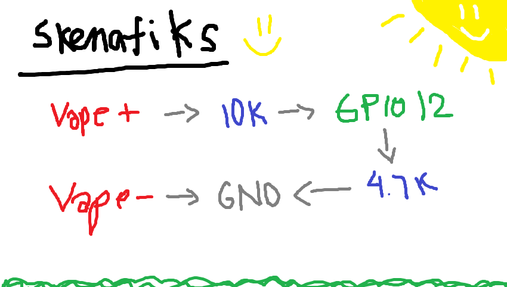

# Reverse Tamagotchi Vape
Instead of you taking care of the pet, the pet takes care of you.. something like that, but its inside the vape.

## Hardwares
- ESP32-S3 R8 LilyGO T-Display (1.9")
- Disposable vape
- 10kΩ + 4.7kΩ resistors
- 3.7V Li-Po battery (rechargeable)

## Setup Stuff
- ESP32-S3 drivers & example code → [LilyGO repo](https://github.com/Xinyuan-LilyGO/T-Display-S3)
- Tool to upload files to ESP32 FATFS → [ESP32FS plugin](https://github.com/lorol/arduino-esp32fs-plugin)  
  > Use Arduino **1.8.xx** (the plugin doesn’t work on 2.x)

## Steps I Did
1. Convert your PNGs to BMPs → run `png-bmp.py`  
2. Upload those BMPs to FATFS on the ESP32  
3. Flash `VAPE_ANIME.ino` onto your board  
4. Do the soldering (check schematics)

I think that's pretty much it. I don't remember. Oh well, I'll upload again if there's something missing. Goodluck Chat
